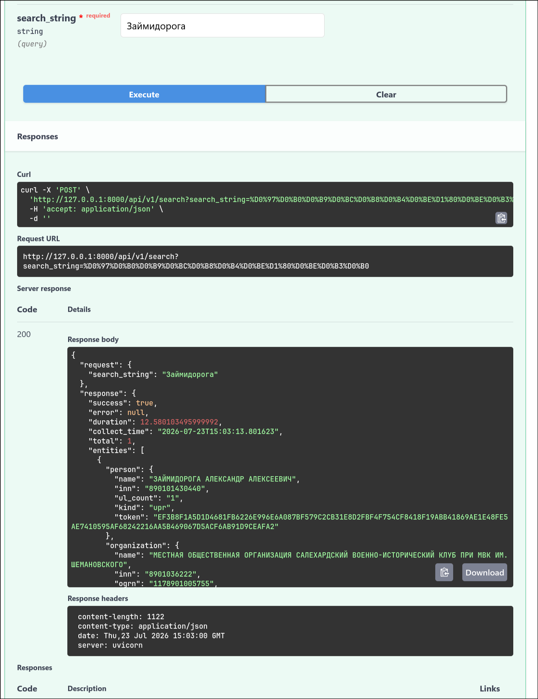
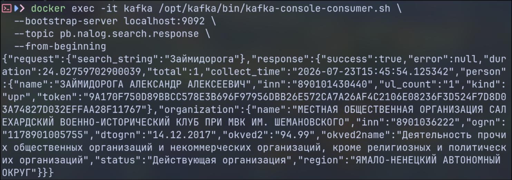

# Сервис ивлечения данных для pb.nalog.ru

>[!NOTE]
> Сервис преданазначен для парсинга данных о директорах и связанных с ними компаниях на сайте pb.nalog.ru

## Ход разработки
### 1. Сбор данных
Эмпирическим путем установил жизненный цикл запроса по поиску директоров. Поиск происходит на вкладке "Участие в ЮЛ", запросы со всех вкладок идут через одну ручку, работающую с разными режимами запроса. В зависимости от режима меняется поле mode в теле запроса. Нашему случаю соответствует mode = "search-upr-uchr".

Поиск c дополнительным полем фильтрации по виду участия, соответвующим чекбоксу "Руководитель", в теле запроса включает uprType1 = "1". 

При этом поиск невозможен, в случае если не выбран хотя бы один чекбокс. В альтернативном случае, если выделены оба чекбокса вид участия, к uprType1 добавляется еще один параметр uprType0, соответсвующий виду участия - "Участник единственный акционер". То бишь значения этих полей в теле запроса характеризует параметры включения директоров в список вывода и представляют собой аналоговый случай булевого значения.

Каждый человек в списке вывода имеет помимо полей inn, fio особое поле token, представляющий собой уникальный идентификатор директора в базе ФНС. Данный токен предназначен для покрытия краеугольного случая с полными тезками.

Получение списка директоров (и в том числе связанных организаций) происходит в два этапа:
1. Первый запрос инициирует задачу поиска директоров по введенным полям фильтрации, в теле этого запроса передаются все необходимые поля для фильтрации. В качесвте результата мы получаем уникальный идентификатор задачи, который необходимо промежуточно сохранять, для последуюего получения результата запроса
2. Второй запрос, включает в своем теле 2 поля: первый - идентификатор, полученный в ответе предыдущего запроса, второй - method = "get-response". В ответе этого запроса получаем уже один или два списка (в зависимости от выставленных чекбоксов) с именами директоров.

Как уже было сказано, у каждого директора есть свой уникальный идентификатор в базе ФНС, он используется для запроса на получение всех связанных с ним организаций посредством запроса с соответствующим mode = "search-ul", где в теле запроса как раз-таки и передается тот самый токен директора. 

В качестве ответа получаем json-чик, в котором нас интересует поле data, представляющий собой масси словарей с данными об связанных организациях. Причем важно уточнить, что параметр uprType пролонгируется и для запроса по поиску связанных организаций

*Промежуточный итог: я понял, какие сущности необходимо использовать для разработки сервиса*

### 2. Формирование методики извлечения
Параллельно с изучением жизненного цикла запроса, я подметил, что взаимодействие фронта с бэком идет посредством образения к апишке. Сама апишка не наделена какой-то замудренной антибот-защитой, для каждого запроса используется только сессионная кука. 

Использование парсеров в таком случае, по моему скромному мнению, было бы избыточным, данные и так доступны напрямую по HTTP.

*Промежуточный итог: понял, что буду использовать обычное обращение по апишке*

### 3. Реализация доменной модели

Согласно требованиям ТЗ, доменный слой не должен зависеть от конкретной инфраструктуры. Поэтому на уровне домена я определил только контракты, то бишь то, что доменной логике нужно от внешнего мира без знания того, как это непосредственно реализовано

Контракт PbNalogClientContract описывает, что нужно доменной логике для добычи данных:
- search_persons, где поиск производится по ФИО или ИНН
- get_organizations, метод производит поиск организаций по конкретному директору

Домен не знает, что за этим контрактом стоит HTTP-клиент.

Контракт ProxyProviderContract описывает модель прокси:
- get_proxy возвращает строку либо None, если прокси не используется или недоступен
- mark_bad помечает прокси нерабочим для исключения его из ротации

SearchDirectorsUseCase реализует сценарий из ТЗ, то есть найти директоров, для каждого получить организации, потом собрать пары человек-организация. Use case также отвечает за замер длительности всей операции (duration) и фиксацию времени окончания сбора (collect_time). Это неотъемлемая характеристика самой операции поиска, а не деталь конкретной точки входа, поэтому она вычисляется один раз в домене, а не дублируется в каждом потребителе.

*Промежуточный итог: реализованы независимые контракты и use case*

### 4. Реализация инфра-слоя
>[!NOTE]
Инфраструктурный слой согласно ТЗ я решил разделить на слой слой адаптеров и непосредственно сам инфраструктурный слой со всей логикой деплоя

#### infra

Перед тем как приступать к непосредственной реализации самого сервиса, необходимо поднять все вспомогательные инструменты и сервисы для работы. Для всего инфра слоя была создана отдельная директория в корне проекта. Внутри непосредственно объявлены 3 файла:
1. docker-compose.yml (где мы поднимаем 3 сервиса: kafka, rmq и наш сервис)
2. .env.example
3. .prod.env (уже непосредственно продовый набор переменных окружения)

#### Adapters (реализация точек входа, http клиента, proxy provider-а с ротацией)

В процессе интенсивного тестирования сервиса pb.nalog.ru начал возвращать ошибку необходимости ввода капчи. Эмпирически было установлено, что это реакция именно на частоту запросов с одного IP. Характер и полнота запроса не влияет на выброс ошибки.

Единственный рабочий способ это обойти, что я и использовал - ротация пула прокси, для снижения нагрузки на конкретный IP. В переменных окруженя я задал через запятую набор прокси адресов.

В целом, его логика максимально простая: при наличии списка прокси, вызов метода поиска директоров сопровождаем отдачей адреса прокси, если прокси недоступен или по каким-то причинам через него нельзя достучаться до ресурса, мы почемаем прокси недоступным и выдаем следующий или None. Тот же алгоритм ротации применяется для исключения по капче.

Ретраи разделены на два независимых механизма, не смешанных в одном решении
- Retry на сетевые сбои реализован через tenacity на уровне единой точки входа _request, покрывающей любой HTTP-вызов к сайту
- Poll на готовность задачи, реализован как явный цикл с ограничением по общему времени, а не количеству попыток, чтобы укладываться в лимит 30 секунд на всю операцию.

Получение организаций для каждого найденного директора выполняется параллельно. Степень параллелизма подбиралась эмпирически через asyncio.Semaphore. Слишком высокое значение увеличивает частоту запросов к сайту и провоцирует капчу быстрее, слишком низкое не укладывается в тайминг при большом количестве директоров. В качестве компромисса выбрано значение 6 с одновременным добавлением случайной задержки перед каждым запросом, чтобы трафик не выглядел равномерно-механическим. С учетом прихотливости по частоте запросов от ресурса, прокси необходимо использовать в любом случае.

При сопоставлении структуры ответов сайта разных организаций обнаружилось, что не все поля присутствуют одинаково стабильно во всех записях.

У директоров неизменны во всех случаях: name, inn, token. поле ul_cnt (количество связанных юрлиц) присутствует всегда, но для чистоты вывода использовано маппирование через validation_alias реального вывода сайта на схему ответа

У организаций наибольшую сложность составило поле кода ОКВЭД. Изначально использовавшиеся okved2, okved2name присутствовали не у всех организаций в выдаче, часть записей содержит эти данные под другими именами. Проблема решена сопоставлением полей через validation_alias на okved2mainб okved2mainname, как более стабильно присутствующий вариант именования в собранной выборке ответов.

*Промежуточный итог: адаптеры изолируют всю специфику стороннего API, включая непостоянство самой схемы ответа, домен и use case об этом ничего не знают*

## Проверка + тесты

В техническом задании было обязательное требование - покрыть unit тестами доменный слой, в моем случае это use case по поиску директоров и связанных с ними компаний. Через конфтест определил класс с псевдоклиентом - FakePbNalogClient.

В тестах рассмотрел следующие кейсы:
- Успешный сбор, на одного директора найдена одна организация
- Пустой результат, когда ни одного директора (ну и соответственно компании не было найдено)
- Усешный сбор нескольких директоров
- Частичный отказ по причине капчи или ошибки у одного из директоров
- Выброс по таймауту

<p align="center">
  
</p>

<p align="center">
  
</p>

## Запуск
В силу специфики залложенной архитектуры, запуск необходимо выполнять из каталога infra/:
```bash
docker-compose --env-file .prod.env up -d
```